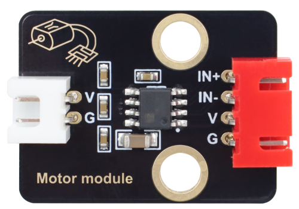
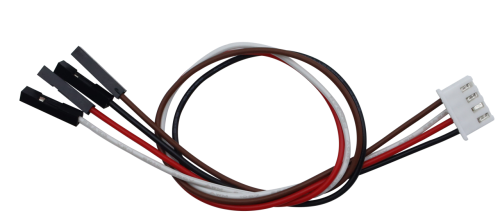
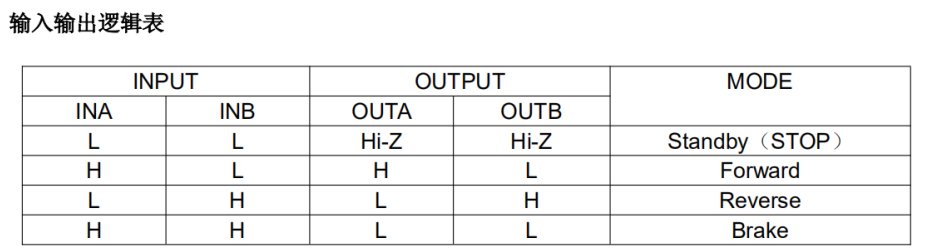
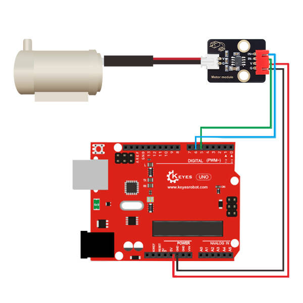

#  Keyes STEM电子积木 130电机-DC3-5V浇花小水泵驱动模块 黑色环保（红色端子）





## 1. 介绍


本水泵驱动模块的核心控制元件采用的是专为直流电机驱动方案设计的单通道H桥驱动器芯片——HR1124S。该芯片的H桥驱动部分集成了低导通电阻的PMOS和NMOS功率管，能够有效降低芯片的整体功耗，从而确保芯片在长时间高负载工作状态下的安全性与稳定性，使得芯片能够安全工作更长时间。此外，HR1124S具备极低的待机电流和静态工作电流，这一优异的功耗管理性能使其非常适合应用于各类玩具方案、小型智能硬件及便携式设备中。

## 2. 规格参数


| 参数           | 值                 |
| -------------- | ------------------ |
| 控制芯片       | HR1124S     |
| 额定电压       | 2V-6.5V             |
| 额定电流       | 低待机电流（0.01uA）和低静态工作电流（0.2mA），连续输出电流1.8A。 |
| 接产品尺寸口       | 31mmx23mm           |
| 工作温度范围       | 1℃ to 50℃  |


## 3. 工作原理


HR1124S采用经典的H桥驱动拓扑结构。H桥由四个开关管（两个PMOS和两个NMOS）组成，形似字母“H”，直流电机连接在H桥的中间横臂上。

*   **正转**：当IN1输入高电平，IN2输入低电平时，H桥左上和右下的开关管导通，电流从正向流过电机，电机正转。
*   **反转**：当IN1输入低电平，IN2输入高电平时，H桥右上和左下的开关管导通，电流从反向流过电机，电机反转。
*   **停止/滑行**：当IN1和IN2均输入低电平时，所有开关管关断，电机两端无电压，电机依靠惯性滑行直至停止。
*   **刹车**：当IN1和IN2均输入高电平时，H桥下臂的两个NMOS管导通，将电机两端短接至地，产生反向电动势制动，实现快速刹车。




| 功能引脚 | 描述 |
| -- | -- |
| G | 电源地 |
| V | 3.3V/5V电源正 |
| IN- | H桥输入1 |
| IN+ | H桥输入2 |
## 4. 接口描述


模块有4个引脚：
| 引脚名称 | 功能说明 | 接线目标 |
| :--- | :--- | :--- |
| **VCC** | 模块电源正极 | 连接至外部直流电源正极（需匹配水泵额定电压） |
| **GND** | 模块电源负极/信号地 | 连接至外部直流电源负极及主控板GND（共地） |
| **IN1** | 控制输入引脚 1 | 连接至主控芯片（如单片机/树莓派）的GPIO口 |
| **IN2** | 控制输入引脚 2 | 连接至主控芯片的GPIO口（建议接支持PWM的引脚） |


## 5. 连接图


| KE4092模块引脚 | Arduino引脚 |
| -------------- | ----------- |
| GND            | GND         |
| VCC            | 5V          |
| IN-             | ~5          |
| IN+              | ~6          |





## 6. Arduino

```cpp
6.1 测试代码1：（高低电平输出控制）
//*****************************************************************************
void setup(){
  pinMode(5, OUTPUT);//数字口5设置为输出
  pinMode(6, OUTPUT);//数字口6设置为输出
}

void loop(){
//设置水泵中的电机顺时针转3000毫秒
  digitalWrite(5,LOW);//设置数字口5为低电平
  digitalWrite(6,HIGH);//设置数字口5为高电平
  delay(3000);//延时3s
//设置水泵中的电机停止转动1000毫秒
  digitalWrite(5,LOW);
  digitalWrite(6,LOW);
  delay(1000);
//设置水泵中的电机逆时针转3000毫秒
  digitalWrite(5,HIGH);
  digitalWrite(6,LOW);
  delay(3000);
//设置水泵中的电机停止转动1000毫秒
  digitalWrite(5,LOW);
  digitalWrite(6,LOW);
  delay(1000);
}
//*****************************************************************************

6.2 测试代码2：（PWM输出控制）
//*****************************************************************************
void setup(){
  pinMode(5, OUTPUT); //数字口5设置为输出
  pinMode(6, OUTPUT); //数字口6设置为输出
}

void loop(){
//设置水泵中的电机顺时针转3000毫秒
  analogWrite(5,0); //设置数字口5的PWM值为0
  analogWrite(6,200); //设置数字口6的PWM值为200
  delay(3000); //延时3s
//设置水泵中的电机停止转动1000毫秒
  analogWrite(5,0);
  analogWrite(6,0);
  delay(1000);
//设置水泵中的电机逆时针转3000毫秒
  analogWrite(5,200);
  analogWrite(6,0);
  delay(3000);
//设置水泵中的电机停止转动1000毫秒
  analogWrite(5,0);
  analogWrite(6,0);
  delay(1000);  
}
//*****************************************************************************
```


检查水泵是否支持3.3V/5V运行,然后根据接线表接线。
在控制板上上传成功后，水泵中的电机顺时针转3秒，停止转动1秒，逆时针转3秒，停止转动1秒。循环进行！
如使用水泵抽水，不要正反转，只有正转，才能最大程度抽水。


## 7.注意事项


为了确保模块和水泵的安全稳定运行，请务必遵守以下操作规范：

1.  **电压匹配**：请确保输入电压（VCC）在HR1124S芯片及所接水泵的额定工作电压范围内，严禁超压使用。
2.  **防堵转保护**：水泵在运行过程中若发生叶轮卡死（堵转），会导致电流急剧上升。虽然芯片内置过热保护，但长时间堵转仍可能损坏模块或水泵，建议在机械结构上增加防卡死设计或在代码中加入电流检测逻辑。
3.  **散热要求**：在驱动较大功率的水泵时，芯片会产生一定热量。请确保模块周围有良好的通风环境，避免被其他发热元件紧贴。
4.  **防水防潮**：驱动模块本身不具备防水功能，在水泵或涉水环境中使用时，请务必对电路板进行防水涂层处理或加装防水外壳，防止水滴短路。
